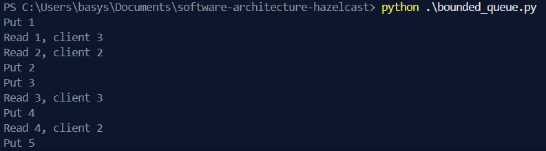

# software-architecture-hazelcast

## Installation
Аби запустити кластер, треба використати `docker compose`:
```
docker compose up
```  
Після цього, management center, та три ноди будуть ініціалізовані.

## Distributed map 
Перевіримо, як працює розподілений map. Подивимося, як hazelcast розподіляє значення на нодах.
### Data allocation   
Використаємо скрипт для заповнення даними наш map ([`./write_test.py`](./write_test.py))
Після завантаження 1000 чисел у map, я отримав наступне:  


Перевіримо, як перерозподілятимуться дані при відключені одніє з нод.  
Зупиняємо третю ноду з допомогою: 

```
docker stop hz-node3
```

  

Можна побачити, що дані з 3 ноди перерозоподілилися між двома іншими. Втрати даних нема.  

Тепер відключимо ще одну ноду:  

```
docker stop hz-node2
```   
  

Аналогічна ситуація: дані з ноди, що впала алокувалися на активній.  


Тепер спробуємо інший експеримент. Просимулюємо crash  -- кілльнемо дві ноди водночас.  

```
docker kill hz-node2 hz-node3
``` 

  

Можна побачити, що дані втратилися.  

 Аби цього запобігти, можна:  
 1) Збільшити `backup-count` в налаштуваннях hazelcast. Зараз в налаштуваннях він дорівнює 1. Це значить, що кожен partition має один оригінал (Primary) та одну копію (Backup). ЯКщо вимикати ноди послідовно, то кластер встигає створити нові бекапи. Якщо паралельно -- втрачається як оригінал, так і бекап partitions на нодах.  
 2) Використовувати асинхронний бекап, коли він створюється у фоні. Проте, є ризик втрати частини даних при крашах. 
 3) Не крашити сервери :)
  

Частину логів з цього експерименту можна знайти в [`./logs/exp1.txt`](./logs/exp1.txt). (vscode terminal з'їдає іншу частину)

### Data consistency
Важливим концепт в паралельному програмуванні є те, як правильно узгоджувати запис та читання з даних, аби ноди не переписували одне одного та не читали неправильні результати. 

Розглянемо кілька різних моделей оновлення числа з кількох клієнтів. Маємо 3 клієнти, що водночас оновлюють змінну.  

#### No lock
Варіант, де немає ніяких обмежень щодо запису. Запустимо [`./write_no_lock.py`](./write_no_lock.py).  

На виході отримано
```
Final value of 'key': 12466
Elapsed time (no locking): 43.89 seconds
```
Хоча очікуваний результат 30000 (якби не було окклюзій та data race) 
#### Pessimistic lock
Песимістичне блокування --  стратегія, яка запобігає конфліктам шляхом негайного обмеження доступу до ресурсу для інших процесів на весь час виконання операції читання та оновлення. 

Він є песимістичним, оскільки припускає, що конфлікти є частими.  

Запустимо [`./write_pessimistic.py`](./write_pessimistic.py)

```
Final value of 'key': 30000
Elapsed time (pessimistic locking): 139.65 seconds
```  
Отримано правильне число.
#### Optimistic lock  
Оптимістична блокування -- "lock", який дозволяє виконувати кілька транзакцій без попереднього блокування даних, а замість цього перевіряє в момент оновлення, чи дані не були змінені іншим процесом з моменту їх останнього зчитування.  

Він є оптимістичним, оскільки припускає, що конфлікти є рідкими.  

Запустимо [`./write_optimistic.py`](./write_optimistic.py)

```
Final value of 'key': 30000
Elapsed time (optimistic locking): 92.77 seconds
```

Так само було отримано правильний результат, та з менший час. 

#### Порівняння та висновки 
Формалізуємо все з попередніх підпунктів у табличку:

| Method             | Elapsed Time | Status         |
|:-------------------|:-------------|:---------------|
| **No lock** | 43.89s       | 12466                |
| **Optimistic lock**| 92.77s       | 30000                | 
| **Pessimistic lock**| 139.65s      | 30000                |  

No lock підходи не слід використовувати, коли є можливість "битви" за дані в коді. Можна побачити, що число є далеким від правди. Навіть попри велику різницю в часі (x2, x3), у цій задачі не можна використовувати такий підхід. 

І оптимістичний, і песимістичний замки показали себе добре. Проте оптимістичний працює швидше, ніж песимістичий.   

Песимістичний підхід слід використовувати при високій імовірності конфліктів. У таких випадках, він буде працювати краще, ніж оптимістичний. Проте, у рамках цієї задачі, себе найкраще показав оптимістичний підхід.

## Bounded queue
Розглянемо bounded queue. Я визначив додаткові налаштування у [`./hazelcast.xml`](./hazelcast.xml), аби обмежити чергу, на 10 елементів.  

Було імплементовано скрипт, де producer записує числа в чергу, а consumers паралельно їх читають.  

Запустимо [`./bounded_queue.py`](./bounded_queue.py):  

 

*Повні логи можна знайти у [`./logs/exp2.txt`](logs/exp2.txt).*

Можна побачити, що є закономірність - `споживає 3 -> споживає 2 -> споживає 3 -> ...` . Клієнти працюють за принципом competing consumers. Якщо два клієнти одночасно намагаються прочитати дані, Hazelcast атомарно віддасть першому вільний елемент, а другому -- наступний. Оскільки швидкість обробки однакова, то ми бачимо рівномірний розподіл. Проте, якби замість простого вивіду числа, була би якась складніша логіка -- ймовірно, "швидший" клієнт забирав більше елементів.  


Також, слід перевірити, чи черга й справді обмежена, та як вона працюватиме, якщо вона буде переповнена, і ніхто її не читатиме.  
Для цього, я визначив окремий скрипт, лише з producer'ом: [`./bounded_queue_overflow.py`](./bounded_queue_overflow.py).  

Отримано наступний результат:
```
Put 1
Put 2
Put 3
Put 4
Put 5
Put 6
Put 7
Put 8
Put 9
Put 10
```  

Після цього, програма заморожується. Це каже про те, що черга й справді обмежена, і при досяганні ліміту, вона чекає, аби хтось нею скористувався.